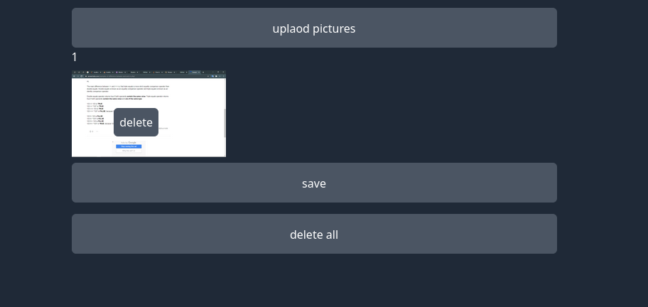

### laravel livewire file upload


livewire - alpineJs - tailwindCss - sweet alert2


## Installation

1. ```git clone https://github.com/amirHossein5/upload-images-livewire.git```
2. ```composer install```
3. ```composer run-script post-root-package-install```

## Screens

|                                              |                                               |
|----------------------------------------------|-----------------------------------------------|
|      |       |
